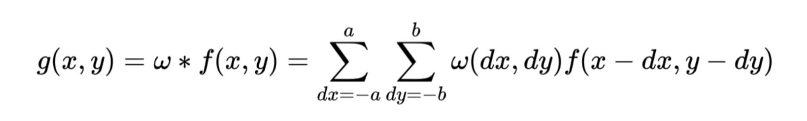
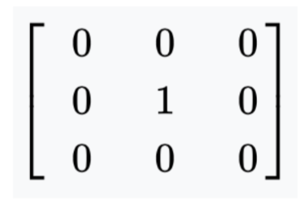
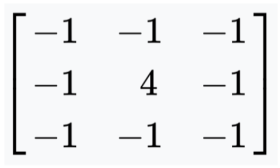
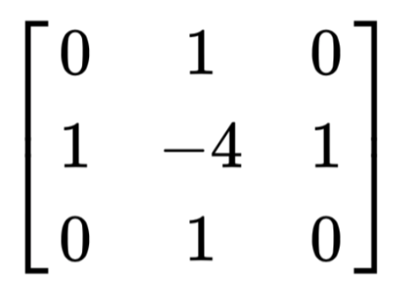

# Blur_Deletion
Blur Deletion is a photo library cleanup tool, focusing on specifically photos that are blurry or out of focus. This tool has two main components:
1. Detecting blurry images
2. Deleting images selected by the user
Users are able to choose if they want to keep or delete images from the blurry photos that are detected, streamlining the process of gallery cleanup. 

This package depends on OpenCV, NumPy, and Matplotlib.

The script blurDelete.py contains the main code necessary to perform the Blur Deletion function. To pass in a photo library as input, run the following line with your path:
```
# run on a directory of images
python blurDelete.py -i <input_directory>/
```
Once this is run, the code processes the images, determines which images are blurry, and successively displays them in order of decreasing blurriness. Users have several key options on what they want to do with the image or how to proceed. Pressing the keys below perform their own respective functions. Some may display confirmation messages on the terminal. Any other key selected during the image selection process will not select the image for deletion and instead will move on to the next image.

`d`: selects the image displayed for deletion

`a`: deletes all the images that have been selected by the algorithm
  * Confirmation message ensuring you want to delete all photos, including ones that have not been displayed yet.
    * `y`: will perform functions as stated above
    * `n`: abandons the delete-all and proceeds as normal with the next image

`s`: deletes only the images that have been selected and keeps the rest in their original directory

At the end of the image selection, the selected images will be displayed in a list, followed by a confirmation to delete all photos listed. If `y` is pressed, the photos will be deleted from the original image directory provided.

# Edge Detection and Blur Classification Technical Notes

Edge detection is a computer vision tool that relies on mathematical methods for identifying sharp discontinuities in a given image. These methods may be deterministic or rely on machine learning models.

Once edge detection is performed on an image, the amount of sharp edges, roughly speaking, can be seen as inversely related to the blurriness of the image. For instance, a blurry image is unlikely to contain many sharp edges by nature, so an edge detection algorithm would not identify many strong discontinuities in the image. We exploit this phenomenon to enable the use of edge detection to score the blurriness of an image and further classify it into blurry or non-blurry based on whether that score meets a certain threshold.

A deterministic method of detecting the edges in a photograph is by performing a convolution (in the mathematical sense, between two functions) between the image and a defined kernel, which outputs a map of the image’s edges. Convolution filtering is a common mathematical technique used for blurring, detecting edges, and more. In general, a convolution of two functions looks like so:




where g is the output image or map altered by the convolution, f is the input image given as a function of some property inherent to each pixel (e.g., brightness), and gamma is the kernel, typically provided as a 3-by-3 mask of values.

A trivial example of convolution filtering at work is by applying the following kernel mask the an image:




When this kernel is used in convolution with an image, the output is exactly the same image. This “identity” kernel behaves this way because the convolution effectively covers every pixel in the image and multiplies its value by one, with no information about neighboring pixels being used.

Therefore the concept can be extended to detecting edges in an image, with a kernel filter such as the following: 




Such a filter as the one above would be able to detect edges in a photograph by weighting neighboring pixels inversely with respect to the center pixel. Therefore, the convolution returns greater values for those areas where sharp changes in the image occur, as the kernel effectively accentuates those discontinuities. 

To perform edge detection for the purpose of classifying blurry images, there are several options for a kernel mask, including the one above. Another kernel, which represents a discrete, truncated approximation of the Laplace operator may be used:




Part of our project included the testing of various kernel masks, and the discrete Laplace operator exhibits a strong capability for edge detection.

Once an image has been convolved with an appropriate edge detection mask, the resulting output (effectively, an edge map) can be analyzed and deterministically identified as representing a blurry image or a non-blurry image. An elegant method for quantifying the sharpness of the image is by calculating the variance of the edge map outputted by convolution. The overall variance of the edge map would roughly correlate to how sharp the image is, so images with a lower variance can be seen as blurry. Therefore, for binary blurry photo classification, all that is needed is to identify an appropriate threshold value for this variance.

For our project, we commit to using a single threshold value across the board, but a more advanced approach could include allowing the user to manually control the sensitivity of the blur detection classifier by simply taking a user input for the threshold value (perhaps normalized on a scale of 1 through 10). With more time, this would be a simple way to update the usefulness of our software.

We would also plan to explore more intelligent ways to decide the optimal threshold value(s) for given images. One approach would be to set up a brute-force algorithm that takes in labeled images (blurry or non-blurry), and manually adjust the threshold until arriving at the value that classifies images with greatest precision and/or recall. A measurable criterion for the optimum could be the F-score, which is commonly used for binary classification and is simply the harmonic mean of the classifier’s precision and recall.

An even more sophisticated technique that could advance the software much closer to perfection is a relatively original research idea which involves breaking down the image into a grid of smaller images, and calculating the variance of the blur map on each of those sub-images, then developing a quantifiable way to classify an image as sharp, even when most of it is in bokeh. Because bokeh is a desirable effect, if a single sub-image can be identified as sharp, then the entire image should potentially be classified as sharp. This is more relevant for professional photographers who use DSLR, SLR, and mirrorless cameras with high-aperture lenses.

Another machine learning approach to finding an optimal threshold could be to incorporate more features from the image, such that the blurriness score contains information not only about the edge map, but also colors, for example. Of particular utility for our application is taking into account when an image is very dull in color (low saturation values), as that may suggest a more boring, junk photo. Clearly, our application could be extended to attack other facets of a messy or clogged photo library.

Indeed, our application sets the foundation for all of these research questions to be explored further, in addition to being useful as a quick tool to run on your messy photo libraries.
